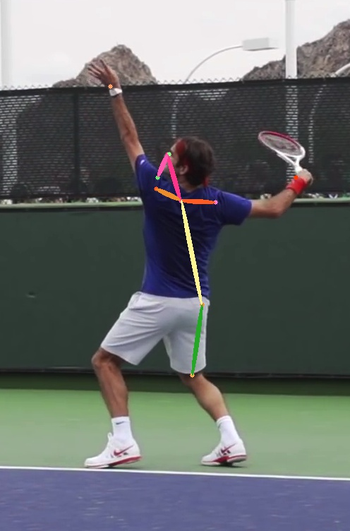

# CPM
Convolutional Pose Machine.  

## 说明
CPM的tf版本，在COCO数据集上训练，还未达到收敛。  
参考：[CPM的tf实现](https://github.com/timctho/convolutional-pose-machines-tensorflow)，该版本并没有
放出数据预处理的代码。我的做法是把COCO数据集中的一个个标注的人切分出来成为新的训练数据，然后在此基础
上训练。由于数据比较原始，缺少清洗以及训练后期收敛很慢，因此结果表现不佳，另外该网络在6个stage下无法
做到实时，在P40上处理368x368的图像在11~18fps之间。

## 看一下Roger的姿态检测结果

    

